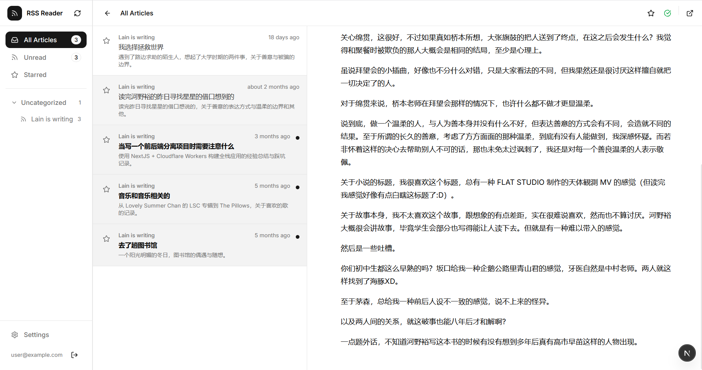

# RSS Reader

一个轻量级的个人 RSS 阅读器，使用 Cloudflare Workers + Next.js 构建。




## 功能特性

### 核心功能
- ✅ RSS 2.0 和 Atom 格式支持
- ✅ 自动定时抓取（Cron Trigger）
- ✅ ETag / Last-Modified 条件请求支持
- ✅ 文章已读/未读状态管理
- ✅ 文章收藏功能
- ✅ OPML 导入/导出
- ✅ 响应式设计，支持移动端

### 界面特性
- ✅ 主题切换（Light / Dark / System）
- ✅ 自定义滚动条样式
- ✅ 文章内容优化渲染
- ✅ 文章搜索（标题、摘要、作者）
- ✅ 未读/收藏数量实时统计
- ✅ 分类管理订阅源
- ✅ 确认对话框（危险操作）

### 快捷键
| 按键 | 功能 |
|------|------|
| J | 下一篇文章 |
| K | 上一篇文章 |
| S | 切换收藏 |
| M | 切换已读状态 |
| O | 打开原文链接 |

## 技术栈

### 后端
- **Cloudflare Workers** - 边缘计算平台
- **Cloudflare D1** - SQLite 数据库
- **Hono** - 轻量级 Web 框架
- **Drizzle ORM** - TypeScript ORM
- **Zod** - 请求验证

### 前端
- **Next.js 15** - React 框架
- **Tailwind CSS v4** - 样式框架
- **Shadcn UI** - 组件库（基于 Base UI）
- **TanStack Query** - 数据获取和缓存
- **Axios** - HTTP 客户端

## 项目结构

```
cfrss/
├── backend/                         # Cloudflare Worker API
│   ├── src/
│   │   ├── db/                     # 数据库 schema 和迁移
│   │   │   ├── migrations/         # SQL 迁移文件
│   │   │   └── schema.ts          # Drizzle schema 定义
│   │   ├── middleware/             # 中间件（鉴权等）
│   │   ├── routes/                 # API 路由
│   │   │   ├── articles.ts        # 文章相关接口
│   │   │   ├── feeds.ts           # 订阅源接口
│   │   │   ├── opml.ts            # OPML 导入导出
│   │   │   └── settings.ts        # 设置接口
│   │   ├── services/               # 业务逻辑
│   │   │   ├── feed-fetcher.ts    # 订阅源抓取
│   │   │   └── rss-parser.ts      # RSS 解析
│   │   └── utils/                  # 工具函数
│   ├── wrangler.toml               # Cloudflare Workers 配置
│   └── package.json
├── frontend/                        # Next.js 前端
│   ├── src/
│   │   ├── app/                    # 页面路由
│   │   │   ├── globals.css        # 全局样式和主题变量
│   │   │   ├── layout.tsx         # 根布局
│   │   │   └── page.tsx           # 主页面
│   │   ├── components/             # React 组件
│   │   │   ├── ui/                # 基础 UI 组件
│   │   │   ├── article-detail.tsx # 文章详情
│   │   │   ├── article-list.tsx   # 文章列表
│   │   │   ├── settings-view.tsx  # 设置页面
│   │   │   ├── sidebar.tsx        # 侧边栏
│   │   │   └── theme-provider.tsx # 主题提供者
│   │   ├── hooks/                  # 自定义 Hooks
│   │   │   ├── use-articles.ts    # 文章相关 hooks
│   │   │   ├── use-feeds.ts       # 订阅源 hooks
│   │   │   └── use-settings.ts    # 设置 hooks
│   │   ├── lib/                    # 工具库
│   │   │   ├── api.ts             # API 客户端
│   │   │   └── utils.ts           # 工具函数
│   │   └── types/                  # TypeScript 类型
│   └── package.json
└── README.md
```

## 快速开始

### 前置要求

- Node.js 18+
- npm 或 pnpm
- Cloudflare 账号（用于部署）

### 本地开发

1. **克隆项目**
   ```bash
   git clone <repo-url>
   cd cfrss
   ```

2. **设置后端**
   ```bash
   cd backend
   npm install

   # 创建 D1 数据库
   npx wrangler d1 create rss-reader

   # 更新 wrangler.toml 中的 database_id

   # 执行迁移
   npm run db:migrate:local

   # 启动开发服务器
   npm run dev
   ```

3. **设置前端**
   ```bash
   cd frontend
   npm install

   # 创建 .env.local 文件
   echo "NEXT_PUBLIC_API_URL=http://localhost:8787" > .env.local

   # 启动开发服务器
   npm run dev
   ```

4. **访问应用**
   - 前端: http://localhost:3000
   - 后端 API: http://localhost:8787

### 部署

1. **部署后端**
   ```bash
   cd backend

   # 更新 wrangler.toml 中的 database_id

   # 执行迁移
   npm run db:migrate

   # 部署
   npm run deploy
   ```

2. **部署前端**
   - 推荐使用 Vercel 或 Cloudflare Pages
   - 设置环境变量 `NEXT_PUBLIC_API_URL` 为后端 URL

3. **配置 Cloudflare Access**
   - 在 Cloudflare Zero Trust 中配置 Access 策略
   - 允许指定 GitHub 账号访问

## API 文档

### Feeds

| 方法 | 路径 | 说明 |
|------|------|------|
| GET | `/api/feeds` | 获取所有 Feed |
| POST | `/api/feeds` | 添加 Feed |
| PUT | `/api/feeds/:id` | 更新 Feed（标题、分类） |
| DELETE | `/api/feeds/:id` | 删除 Feed |
| DELETE | `/api/feeds` | 删除所有 Feed |
| POST | `/api/feeds/:id/refresh` | 刷新指定 Feed |
| POST | `/api/feeds/refresh-all` | 刷新所有 Feed |

### Articles

| 方法 | 路径 | 说明 |
|------|------|------|
| GET | `/api/articles` | 获取文章列表（分页） |
| GET | `/api/articles/unread` | 获取未读文章 |
| GET | `/api/articles/starred` | 获取收藏文章 |
| GET | `/api/articles/stats` | 获取未读和收藏数量 |
| GET | `/api/articles/:id` | 获取单篇文章 |
| PATCH | `/api/articles/:id/read` | 标记已读 |
| PATCH | `/api/articles/:id/unread` | 标记未读 |
| PATCH | `/api/articles/:id/star` | 收藏 |
| PATCH | `/api/articles/:id/unstar` | 取消收藏 |
| POST | `/api/articles/mark-all-read` | 全部标记已读 |
| POST | `/api/articles/mark-feed-read/:id` | 标记指定 Feed 已读 |

**查询参数（文章列表）：**

| 参数 | 类型 | 说明 |
|------|------|------|
| `page` | number | 页码（默认 1） |
| `per_page` | number | 每页数量（默认 20，最大 100） |
| `sort` | string | 排序字段：`published_at`、`created_at`、`title` |
| `order` | string | 排序方向：`asc`、`desc` |
| `feed_id` | string | 按 Feed ID 过滤 |
| `is_read` | number | 按已读状态过滤：`0`、`1` |
| `is_starred` | number | 按收藏状态过滤：`0`、`1` |
| `q` | string | 搜索关键词（搜索标题、摘要、作者） |

### OPML

| 方法 | 路径 | 说明 |
|------|------|------|
| POST | `/api/opml/import` | 导入 OPML |
| GET | `/api/opml/export` | 导出 OPML |

### Settings

| 方法 | 路径 | 说明 |
|------|------|------|
| GET | `/api/settings` | 获取设置 |
| PUT | `/api/settings` | 更新设置 |

## 配置说明

### 环境变量

#### 后端 (wrangler.toml)
```toml
[vars]
CF_ACCESS_AUD = "your-access-aud"  # Cloudflare Access AUD
```

#### 前端 (.env.local)
```env
NEXT_PUBLIC_API_URL=http://localhost:8787  # 后端 API 地址
```

### 设置项

| 设置 | 说明 | 默认值 |
|------|------|--------|
| `refresh_interval` | 自动刷新间隔（分钟） | 30 |
| `ui_theme` | 主题（light/dark/system） | system |
| `ui_articles_per_page` | 每页文章数 | 20 |

## 许可证

MIT
